#   Seishin's Iris Yin-Yang

> **COLEMAK-DHm** layout with some programmer's QoL tweaks.
> Running on an Keebio Iris rev.7 board with **Durock Shrimp (Silent Tactile T1) Switches**.
> 

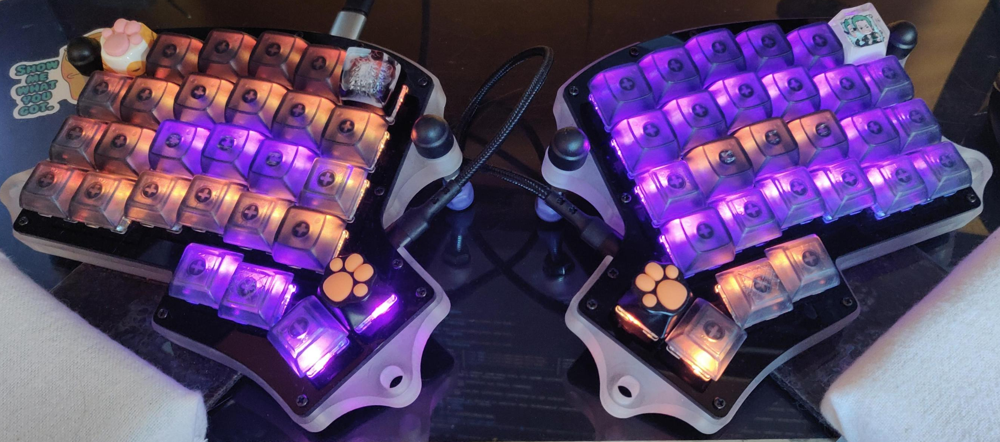
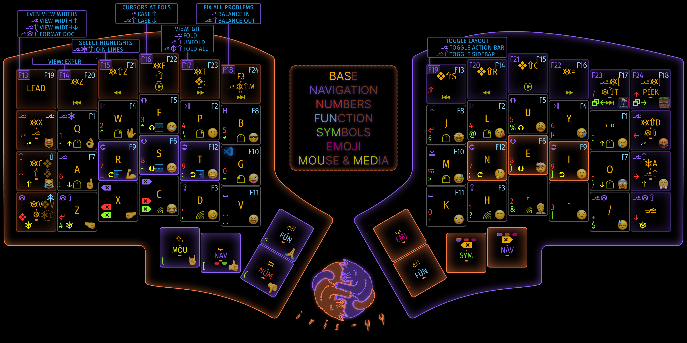

##  🌟LAYERS
### 〰 BASE
💎 **COLEMAK-DHm** layout
  - Optimized for writing in english
  - most programming languages use english for syntax

💎 PEEK key
  - <kbd>Win</kbd> + <kbd>,</kbd> - quickly view the cheatsheet, displayed on the deskdop via Rainmeter, using Windows Peek functionality

💎 LEADER key
  - vim style sequences for useful commands & combos

### 〰 VSC & RGB
- active vsc tab split in all directions
- RGB matrix controls (not on cheatsheet)
- RGB custom animation values indicators

### 〰 GAMING: Portal
- toggle ON: <kbd>EMJ</kbd> + <kbd>PORTAL</kbd> (next to <kbd>PEEK</kbd>)
- toggle OFF: <kbd>PEEK</kbd>

### 〰 GAMING: Minecraft
- toggle ON: <kbd>EMJ</kbd> + <kbd>MC</kbd> (<kbd>PEEK</kbd>)
- toggle OFF: <kbd>PEEK</kbd>
- todo - layout, when have time to play

##  🌟KEYCAPS 
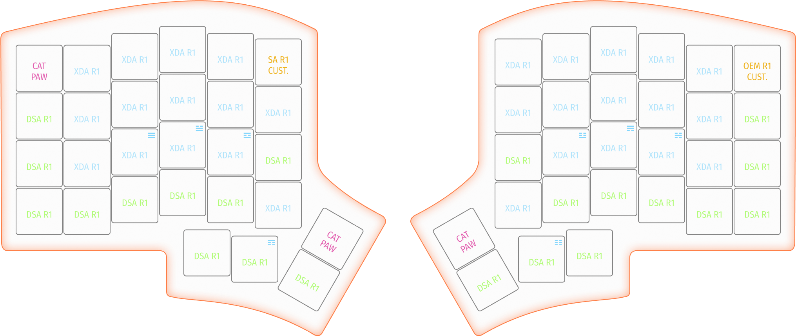

##  🌟LIGHT EFFECTS
- Custom RGB matrix dimm-twinkling animation
  - Halves, homing keys & thumb cluster colors matching the cheatsheet image
  - Main color of the *left* side is controlled with <kbd>HUI</kbd>/<kbd>HUD</kbd>
  - Of the *right* side with <kbd>SPI</kbd>/<kbd>SPD</kbd>
- Orange/Violet SETTINGS 😎
  - HSV [  5,255,120] SPD [222]
  - Animation preview: [youtube](http://www.youtube.com/watch?v=_Q-zyaq3e3U)

### RGB Layers & mods indicators
|        | MOD-KEYS                        |        |                                   |
| ------ | ------------------------------- | ------ | --------------------------------- |
| alt    | 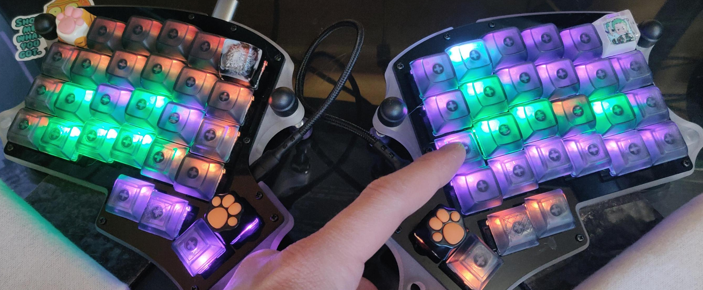 | altgr  |  |
| ctrl   | 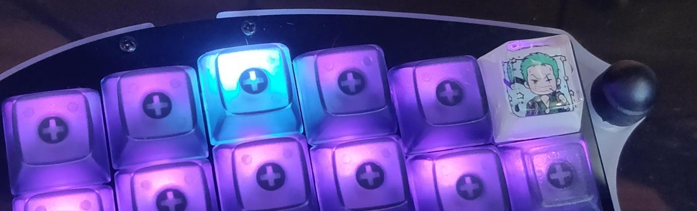 | shift  | 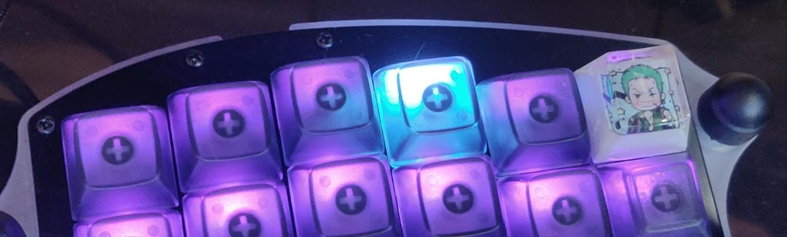 |
| win    | 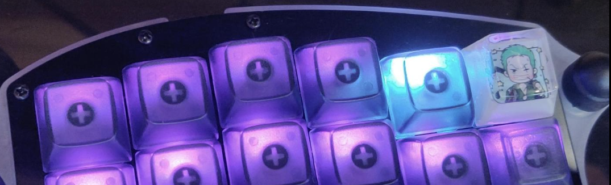   | leader | 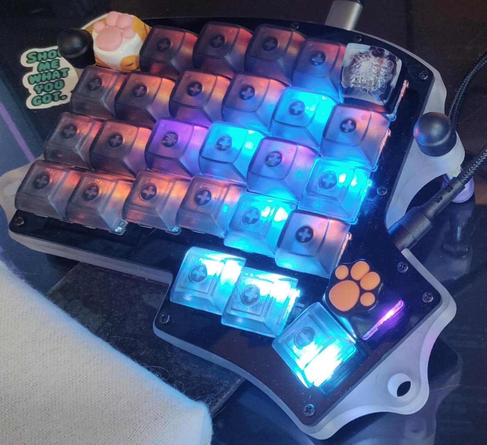   |

| LAYERS                    |                             |
| ------------------------- | --------------------------- |
| NAVIGATION                | NUMBERS                     |
| 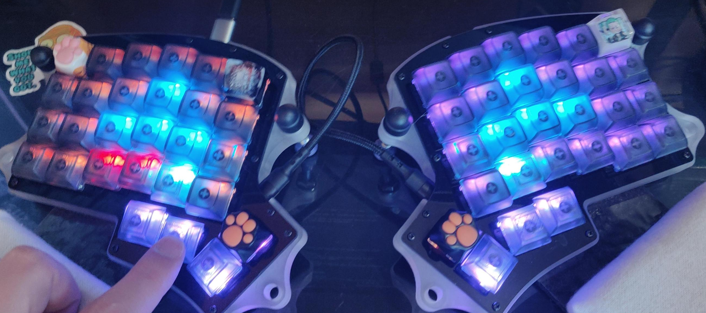 | 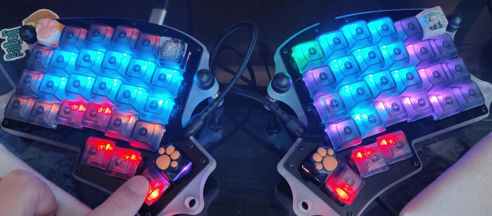   |
| FUNCTION                  | SYMBOLS                     |
| 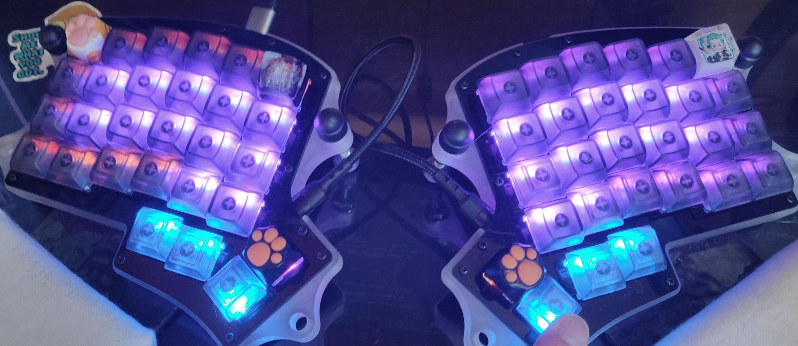 | 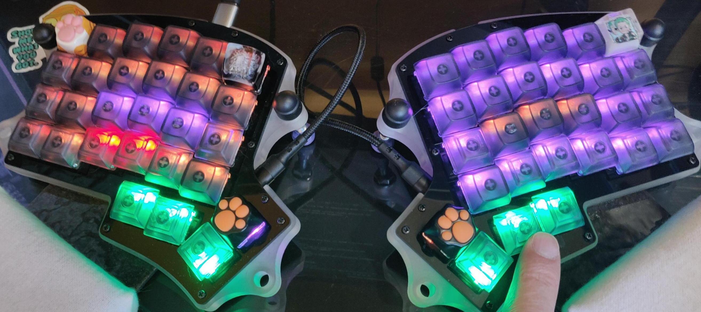   |
| EMOJI                     | MOUSE & MEDIA               |
| 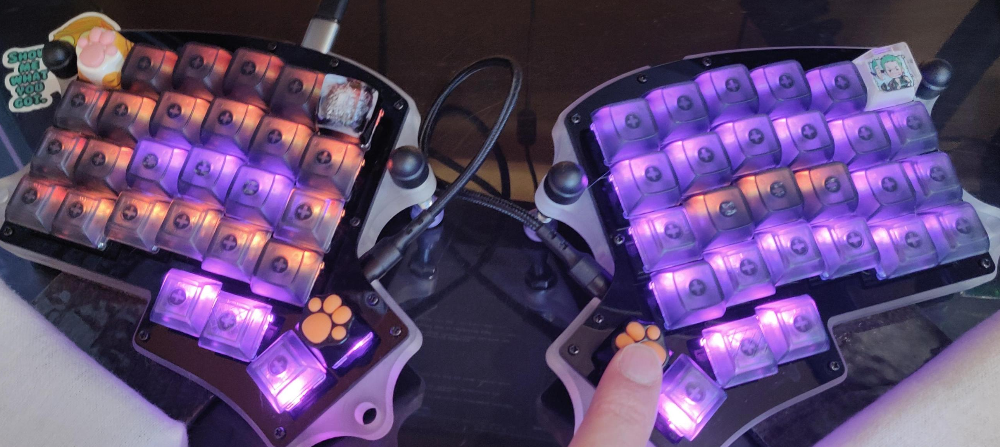 | 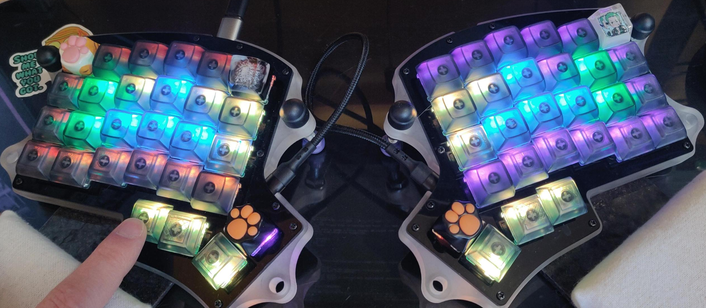   |

##  🌟TODOs
- swap top row caps to custom resin ones with SA/R1 profile
<figure>
  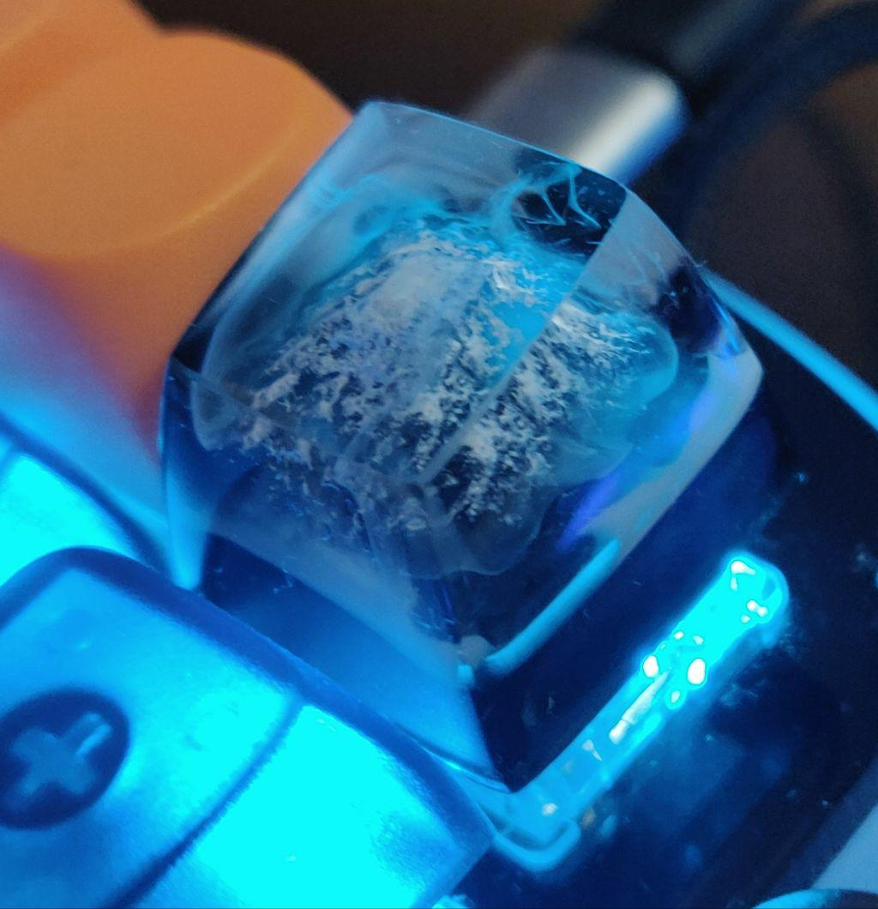
  <figcaption>like this one</figcaption>
</figure>

##  🌟My keyboards history
- [keyboards.md](keyboards.md)
